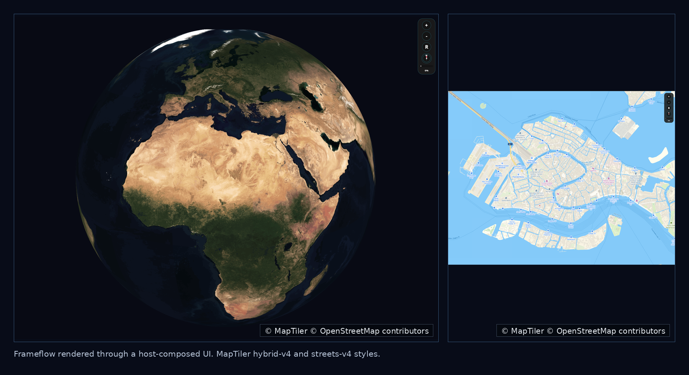

# Frameflow

Frameflow is a native C++ rendering runtime for interactive geographic discovery
surfaces.

It is designed for host applications that already own their domain model,
networking, authentication, persistence, and UI composition. Frameflow keeps the
native boundary small: hosts send point snapshots, filters, camera/input
commands, and lifecycle events; Frameflow owns native scene state, rendering,
diagnostics, and selection events.

## Status

Frameflow is a technical preview. The Linux/offscreen path is the first
validated runtime path. APIs may change before a stable release.

## Why Frameflow Exists

Frameflow started from a practical need for a lightweight native globe and
rendering layer that can be embedded into newsroom, broadcast, and geographic
discovery workflows without moving the host application's domain model,
networking, authentication, persistence, or UI composition into the renderer.

The goal is to keep the native boundary small: host applications keep their
product logic and UI, while Frameflow provides native scene state, rendering,
diagnostics, camera/input handling, and selection feedback.

Frameflow is intended as an embedded geographic discovery surface, not as a full
application framework.

## Preview



Screenshots use MapTiler `hybrid-v4` and `streets-v4` styles. Map imagery:
© MapTiler, © OpenStreetMap contributors. See MapTiler attribution guidance:
https://www.maptiler.com/copyright/

## Highlights

- C ABI shared library for host applications.
- C++ core model for geo point snapshots, filters, selection, and diagnostics.
- Offscreen bitmap presentation for host-composed UI rendering.
- Experimental native-surface descriptors for Linux X11 child-window
  integrations.
- Optional Cesium Native scene path behind `FRAMEFLOW_WITH_CESIUM=ON`.
- Runtime imagery providers for Google Maps, MapTiler raster maps, and Stadia
  raster maps.
- Regression tests for bridge contracts, lifecycle, diagnostics, and rendering
  behavior.

Frameflow does not own search, editor workflows, authentication, backend APIs,
or canonical business data. Hosts translate their own domain objects into the
Frameflow point/filter contract.

## Repository Layout

```text
cmake/      CMake helper modules
include/    public C and C++ headers
src/        bridge, core model, renderer/runtime implementation
examples/   smoke examples
tests/      C++ bridge/core tests and host prototype tests
```

## Requirements

Default build:

- CMake 3.24+
- C++20 compiler
- Ninja, when using the provided presets

Optional Linux native-surface examples:

- X11 development libraries

Optional Cesium build:

- Git, used by CMake to validate the configured Cesium Native checkout
- Compatible `cesium-native` checkout at `third_party/cesium-native`, or a
  checkout path provided through `FRAMEFLOW_CESIUM_NATIVE_SOURCE_DIR`
- Cesium Native dependency tooling, or a compatible vcpkg toolchain
- OpenGL, X11, and GLX development libraries for Linux GLX examples

## Build

Default development build:

```bash
cmake --preset dev
cmake --build --preset dev
ctest --preset dev
```

CI-style build with warnings as errors:

```bash
cmake --preset ci
cmake --build --preset ci
ctest --preset ci
```

The default build keeps `FRAMEFLOW_WITH_CESIUM=OFF`.

## Optional Cesium Native

Cesium integration is disabled by default. To enable it, place a compatible
`cesium-native` checkout at `third_party/cesium-native` or set
`FRAMEFLOW_CESIUM_NATIVE_SOURCE_DIR`.

Configure and test:

```bash
cmake --preset cesium-dev
cmake --build --preset cesium-dev
ctest --preset cesium-dev
```

Run the Linux GLX globe smoke on an X11/OpenGL host:

```bash
cmake --build --preset cesium-globe-smoke
DISPLAY=:0 ./build/cesium-dev/frameflow_cesium_globe_smoke --auto-exit-ms=600 --cycles=2
```

## Imagery Providers

Frameflow does not ship provider credentials. Runtime imagery is optional and
must be configured by the host or operator.

Supported provider selectors:

```bash
FRAMEFLOW_BASEMAP_PROVIDER=google-maps
FRAMEFLOW_BASEMAP_PROVIDER=maptiler-raster
FRAMEFLOW_BASEMAP_PROVIDER=stadia-raster
```

Google Maps:

```bash
export FRAMEFLOW_BASEMAP_PROVIDER=google-maps
export FRAMEFLOW_GOOGLE_MAPS_API_KEY
```

MapTiler raster:

```bash
export FRAMEFLOW_BASEMAP_PROVIDER=maptiler-raster
export FRAMEFLOW_MAPTILER_API_KEY
export FRAMEFLOW_MAPTILER_MAP_ID=streets-v4
```

Stadia raster:

```bash
export FRAMEFLOW_BASEMAP_PROVIDER=stadia-raster
export FRAMEFLOW_STADIA_API_KEY
export FRAMEFLOW_STADIA_STYLE=alidade_smooth_dark
```

Users are responsible for provider terms, quota, billing, attribution, and
operational limits such as HTTP 429 responses.

## C ABI

The public C bridge exposes opaque engine handles, lifecycle functions,
point/filter input, selection and camera events, diagnostics, and offscreen frame
copy helpers.

Compatibility and threading contract:

- `frameflow_bridge_abi_version()` identifies the native ABI generation.
- `frameflow_bridge_check_compatibility(...)` validates bridge and command
  major versions before host bindings create long-lived engine handles.
- Public engine operations are serialized per engine handle.
- Host code should avoid long-running calls on UI/event-dispatch threads.
- Callbacks are invoked without holding the engine lock.
- Callback payload pointers are valid only during the callback invocation.
- The host owns handle lifetime; `destroy` must not race with other API calls
  for the same handle.

See `include/frameflow/c/bridge.h` for the exact ABI.

## Renderer Threading

The offscreen bitmap path is host-driven: the host sends lifecycle/input
commands and requests frames through the C bridge, while the host UI presents the
copied frame.

The native-surface path owns a dedicated render worker thread. Host calls enqueue
surface mutations and frame requests through a command queue; the worker owns
surface creation, resize, visibility, pause/resume, presentation, and teardown.

## Diagnostics

Diagnostics report lifecycle state, surface backend, render backend, queue
pressure, selected location, filters, frame state, and native runtime status.

Default diagnostics do not expose raw native window handles or API keys. Handle
fields report presence/state instead of raw pointer or window values.

Verbose renderer logs are opt-in:

```bash
export FRAMEFLOW_LOG_LEVEL=debug
```

## Cartography And Overlays

Frameflow can render configured basemap imagery and can also draw host-provided
cartographic overlays. Boundary and label interpretation is data-driven; the
renderer displays the supplied imagery and overlay data and does not hardcode
political boundary semantics.

## License

Frameflow is licensed under the Apache License, Version 2.0. See `LICENSE`.

Third-party and provider notes are summarized in `THIRD_PARTY_NOTICES.md`.
